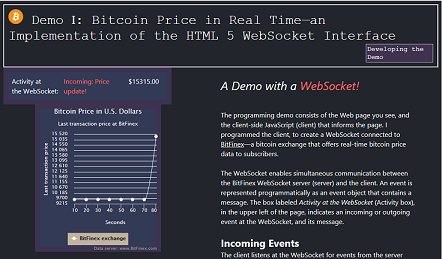

# Demo I: Bitcoin Price in Real Time—an Implementation of the HTML 5 WebSocket Interface 
## A Demo with a <em font-size="14" style= "color:#ff6666;"><b>WebSocket!</b></em>" :blush:
##### Beta Version 1.0
###### This document was first issued on November 1, 2017.
 
## Welcome to the README!
WebSockets are cool because they enable servers to push data to clients&mdash;data
without the pull that HTTP GET requests require.

The sections that follow describe the source code files, functionality, and API implementations
of the JavaScript client.   

## Source Code Files

The *js-client-socket.js* file contains the JavaScript client.
The CSS folder contains the Cascading Style Sheets, level 2 (CSS2) file.

### Required Scripts
The client requires the following scripts to run:

* highcharts.js: The client uses the  [Highcharts API]('https://www.highcharts.com/') to
    create the chart on the Web page of the demo.

* jquery-3.2.1.js: The client uses the JQuery *ready* event to begin script execution.

These scripts are included in the *index.html* file.

## Functionality

 The JavaScript client in Demo I gets real-time bitcoin price updates from a Bitfinex WebSocket server and 
 displays the prices in a chart, as shown in the following graphic:  

## API Implementations
The JavaScript client implements selected functions from the following APIs:

  * *HTML 5 WebSocket Interface*: enables the JavaScript client to open a WebSocket connected to a WebSocket
        server at BitFinex&mdash;a bitcoin exchange. View the API at
        https://html.spec.whatwg.org/multipage/web-sockets.html#network
        
  * *BitFinex WebSocket API*: enables the JavaScript client to receive real-time prices from a
     BitFinex WebSocket server. View the API at https://bitfinex.readme.io/v2/docs/ws-general
         
  * *Highcharts API*: enables the JavaScript client to draw and update a spline chart with bitcoin prices. 
         View the API at https://api.highcharts.com/highcharts/

