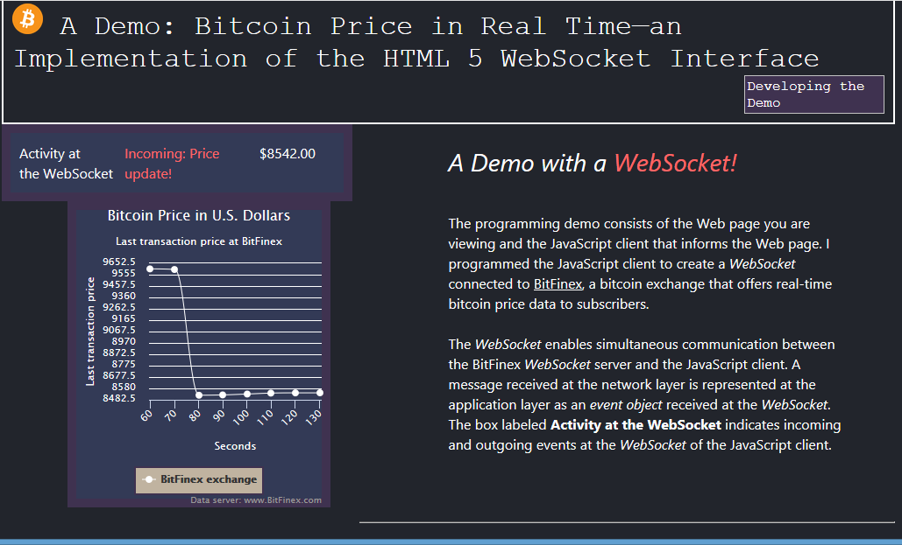

# Demo : Bitcoin Price in Real Time—an Implementation of the HTML 5 WebSocket Interface 
## A Demo with a <em font-size="14" style= "color:#ff6666;"><b>WebSocket!</b></em> :blush:
##### Beta Version 1.0
###### This document was first issued on November 1, 2017.
 
## Welcome to the README!
WebSockets are cool because they enable servers to push data to clients
without the client pull that HTTP GET requests require.

The sections that follow describe the source code files, functionality, and known issues of the demo.   

## Source Code Files

The *js-client-socket.js* file contains the source code of the JavaScript client.
The Cascading Style Sheets, level 3 (CSS3) file is located in the css folder.

### Required Scripts
The JavaScript client requires the following scripts to run:

* highcharts.js: The client uses the  [Highcharts API]('https://www.highcharts.com/') to
    create the chart on the Web page of the demo.

* jquery-3.2.1.js: The client uses the JQuery *ready* event to begin script execution.

These scripts are included in the *index.html* file.

## Functionality

 As shown in the graphic that follows, the JavaScript client gets real-time bitcoin prices from a
 Bitfinex WebSocket server and displays the prices in a chart.  

## Known Issues
This section provides information about known issues in Beta Version 1 of the demo.

* **Insufficient Testing of the JavaScript Client with Small Viewports**

   * Code in the CSS3 file proportionally sizes the font and Document Object Model (DOM) elements  
     in rem units. Media queries in the CSS3 file style Web page elements. However, this CSS3 code was 
     not tested extensively with small viewports (less than 768 pixels in width).
  
* **No Testing of the JavaScript Client on the iOS Mobile Operating System** 

   * The client was only tested with Safari on an OS X operating system.

* **The JavaScript Client Freezes when Run with Konqueror, a Linux Browser**

   * The Javascript client does not draw the Web page chart. It is not clear whether the script is even loading.

    
  
