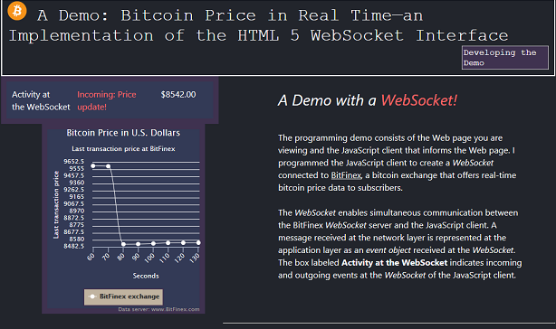

# Demo : Bitcoin Price in Real Time—an Implementation of the HTML 5 WebSocket Interface 
## A Demo with a <em font-size="14" style= "color:#ff6666;"><b>WebSocket!</b></em> :blush:
##### Beta Version 1.0
###### This document was first issued on November 1, 2017.
 
## Welcome to the README!
WebSockets are cool because they enable servers to push data to clients
without the client pull that HTTP GET requests require.

The sections that follow describe the source code files, functionality, and API implementations
of the JavaScript client.   

## Source Code Files

The *js-client-socket.js* file contains the JavaScript client.
The CSS folder contains the Cascading Style Sheets, level 2 (CSS2) file.

### Required Scripts
The client requires the following scripts to run:

* highcharts.js: The client uses the  [Highcharts API]('https://www.highcharts.com/') to
    create the chart on the Web page of the demo.

* jquery-3.2.1.js: The client uses the JQuery *ready* event to begin script execution.

These scripts are included in the *index.html* file.

## Functionality

 The JavaScript client in Demo I gets real-time bitcoin price updates from a Bitfinex WebSocket server and 
 displays the prices in a chart, as shown in the following graphic.  

## Known Issues
This section provides information about known issues in Beta Version 1.

* **Insufficient Testing of the Client across the Spectrum of Mobile Device Sizes and Platforms.**

     * The CSS file of the client uses proportional sizing of Document Object Model (DOM) elements
       in rem units and Media queries to adapt the content to smaller viewport sizes (320px-768px in width). 
       However, this code was not tested with all possible viewport sizes.
         
     * The client was not tested with all browsers for the iOS, Windows Mobile, and Android Platforms.
       There are about 25 different browsers. Many of the browsers use the same browser engine, such as
       WebKit. However, no attempt was made to categorize which browsers use the same engine to determine
       the extent of test coverage across browsers. The client was tested with the following browsers:
       Opera, Internet Explorer, Edge, Chrome, Firefox, Konqueror, and Clicz.
 
* **The Client Freezes when Run with Konqueror.**
    The client does not draw the Web page chart. It is not clear whether the script is even loading.
    
 

    
  
